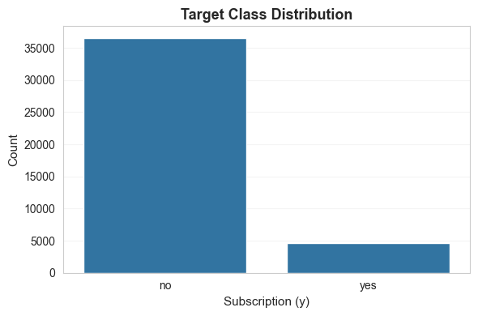
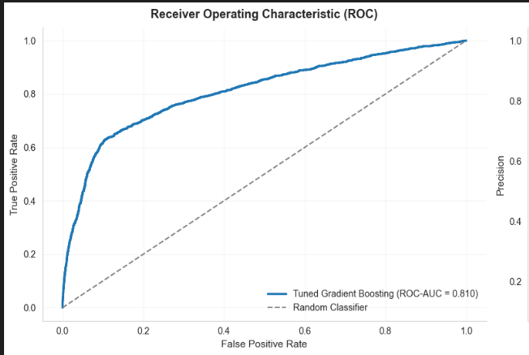
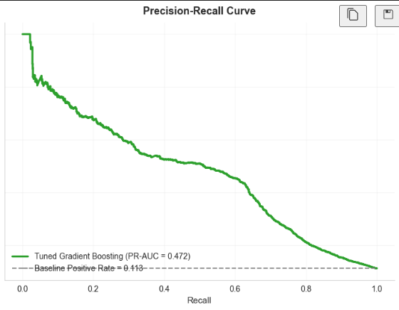
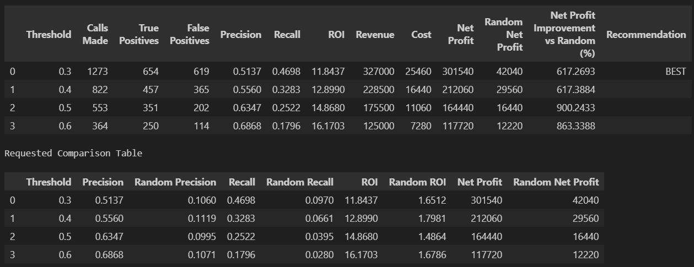
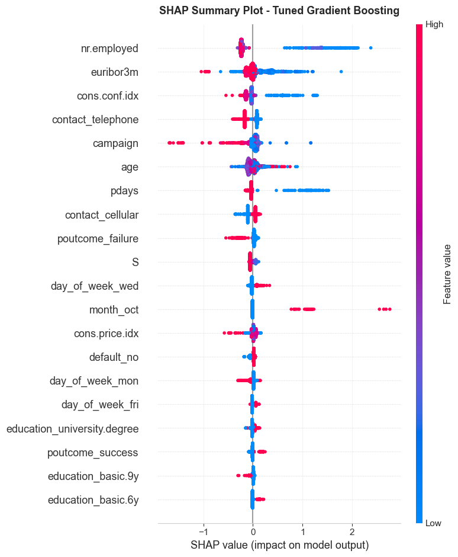

# A Data-Driven Solution to Inefficient Bank Marketing Campaigns


In a dataset of 41,188 bank customers, only ~11% subscribed to a term deposit. Traditional marketing campaigns call every customer, resulting in high operational cost and low return. This project replaces blanket calling with probability-driven targeting using machine learning and threshold optimization to maximize net profit. The focus was not model accuracy alone — it was financial impact.

---

## Table of Contents

- [Executive Summary](#executive-summary)
- [Business Problem](#business-problem)
- [Dataset Overview](#dataset-overview)
- [Methodology](#methodology)
- [Model Performance](#model-performance)
- [Business Optimization](#business-optimization)
- [Results at Optimized Threshold](#results-at-optimized-threshold)
- [Key Insights](#key-insights)
- [Tools & Technologies](#tools--technologies)
- [Installation](#installation)
- [Usage](#usage)
- [Project Structure](#project-structure)
- [License](#license)
- [Contributing](#contributing)

---

## Executive Summary

Traditional marketing campaigns often rely on volume rather than precision, leading to wasted resources and lower ROI. By analyzing customer data, we can identify high-probability prospects and tailor outreach efforts. This project demonstrates how a data-driven approach can significantly improve campaign efficiency and profitability.

---

## Business Problem

- **Conversion rate:** ~11%
- **Challenges:** Severe class imbalance, high cost per outbound call.
- **Goal:** Identify who should NOT be contacted to reduce waste while retaining most conversions.
- **Core Question:** Who are the high-value targets?

---

## Dataset Overview

- **Size:** 41,188 customer records.
- **Target:** Binary classification (Subscribed: Yes / No).
- **Features:** Behavioral, demographic, and campaign interaction variables.

### Class Distribution



---

## Methodology

1.  **Data Cleaning & Preprocessing:** Handling missing values, encoding categorical variables.
2.  **Exploratory Data Analysis (EDA):** Understanding distributions and correlations.
3.  **Feature Engineering:** Creating meaningful predictors.
4.  **Model Benchmarking:**
    -   Logistic Regression
    -   Random Forest
    -   Gradient Boosting
5.  **Evaluation:** Cross-validation using ROC-AUC, Precision-Recall due to imbalance.
6.  **Optimization:** Threshold tuning to maximize profit based on operational costs and revenue.

---

## Model Performance

- **Final Model:** Gradient Boosting Classifier.
- **Cross-validated ROC-AUC:** ~0.93.
- **Metrics:** Evaluated using ROC and Precision-Recall curves.

### ROC Curve



### Precision-Recall Curve



---

## Business Optimization

Using the default probability threshold (0.50) does not maximize profit. By optimizing the decision threshold to ~0.35, we balance recall and cost efficiency.

### Profit vs Threshold



---

## Results at Optimized Threshold

- **Efficiency:** 40–45% fewer customers contacted.
- **Recall:** Majority of actual subscribers retained.
- **Profit:** ~50%+ higher net profit compared to blanket calling at the same volume.

---

## Key Insights

The most influential predictors were:

- **Call duration:** Longer calls correlate with higher success (though tricky to use proactively).
- **Previous campaign outcome:** Past success is a strong predictor.
- **Contact timing:** Certain months/days yield better results.

Demographic variables were less impactful than behavioral indicators.

### Feature Importance



---

## Tools & Technologies

- **Language:** Python
- **Libraries:** Pandas, NumPy, Scikit-learn, Matplotlib, Seaborn, SHAP

---

## Installation

1.  Clone the repository:
    ```bash
    git clone https://github.com/yourusername/bank-marketing-campaign.git
    cd bank-marketing-campaign
    ```

2.  Install dependencies:
    ```bash
    pip install -r requirements.txt
    ```

---

## Usage

1.  **Download the Dataset:**
    The dataset `bank.csv` is required but not included in the repository. Please download the [Bank Marketing Data Set](https://archive.ics.uci.edu/ml/datasets/Bank+Marketing) (or ensure you have the correct `bank.csv` file).

2.  **Place the Dataset:**
    Move `bank.csv` to the `source notebook/` directory (or update the path in the notebook).

3.  **Run the Notebook:**
    Launch Jupyter Notebook:
    ```bash
    jupyter notebook
    ```
    Open `source notebook/Data driven solution to Inefficient bank marketing campaigns.ipynb` and run all cells.

---

## Project Structure

```
.
├── images/                 # Visualizations generated by the analysis
├── source notebook/        # Jupyter notebook containing the code
│   └── Data driven solution to Inefficient bank marketing campaigns.ipynb
├── README.md               # Project documentation
└── requirements.txt        # Python dependencies
```

---

## License

This project is licensed under the MIT License - see the [LICENSE](LICENSE) file for details.

---

## Contributing

Contributions are welcome! Please open an issue or submit a pull request for any improvements or bug fixes.

1.  Fork the repository.
2.  Create your feature branch (`git checkout -b feature/AmazingFeature`).
3.  Commit your changes (`git commit -m 'Add some AmazingFeature'`).
4.  Push to the branch (`git push origin feature/AmazingFeature`).
5.  Open a Pull Request.
